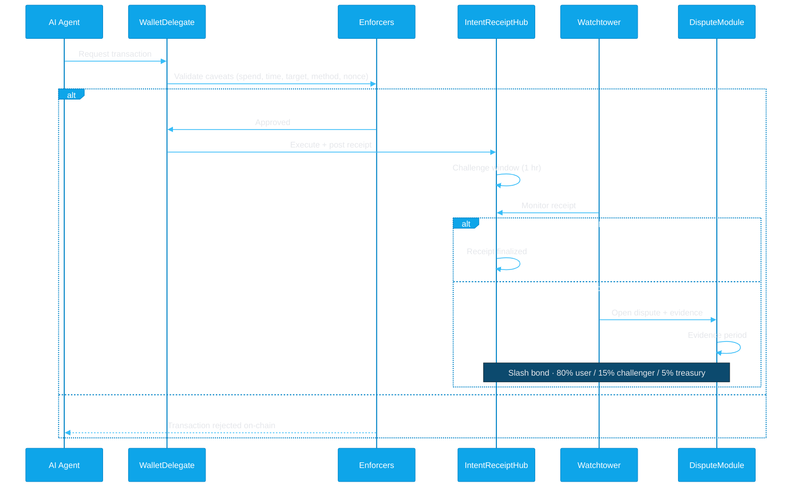
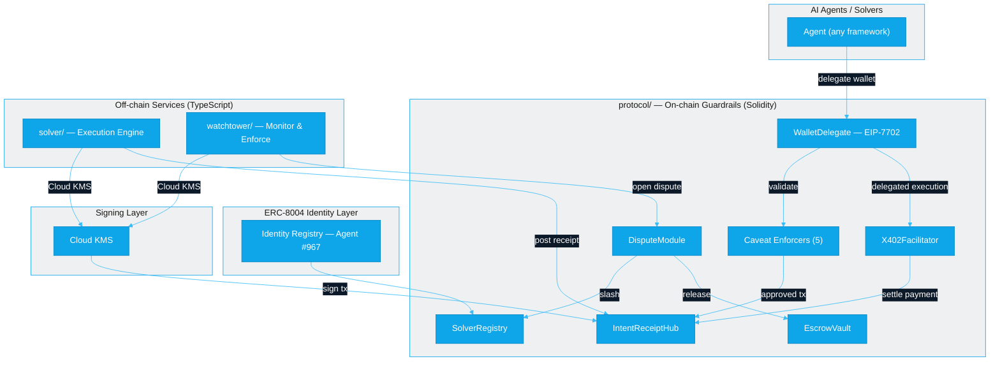

<p align="center">
  <picture>
    <source media="(prefers-color-scheme: dark)" srcset="assets/irsb-banner-dark.svg">
    
  </picture>
</p>

<p align="center">
  <a href="https://github.com/intent-solutions-io/irsb/blob/main/LICENSE"></a>
  
  
  
  
</p>

---

> **AI agents are executing on-chain transactions with wallet access but no guardrails — no spend limits, no audit trails, no recourse when things go wrong.** IRSB provides on-chain policy enforcement via EIP-7702 delegation, cryptographic receipts for every action, and automated dispute resolution. The same infrastructure secures intent-based DeFi solvers.

## Why IRSB

Every major AI agent framework gives agents wallet access. None of them prove what the agent did, limit what it can spend, or provide recourse when it acts outside its mandate.

| Capability | AgentKit | ElizaOS | Olas | Virtuals | **IRSB** |
|------------|----------|---------|------|----------|----------|
| Wallet access | Coinbase API | Lit/KMS | Safe multisig | TBA/bonding | **EIP-7702 delegation** |
| Spend limits | None | None | Consensus | None | **On-chain enforcers** |
| Execution receipts | None | None | None | None | **Cryptographic proof** |
| Automated monitoring | None | None | None | None | **Watchtower** |
| Dispute resolution | None | None | None | None | **On-chain arbitration** |

## On-Chain Guardrails

IRSB uses EIP-7702 WalletDelegate with five caveat enforcers — deployed and verified on Sepolia:

| Enforcer | What It Does |
|----------|-------------|
| **SpendLimitEnforcer** | Daily and per-transaction spending caps |
| **TimeWindowEnforcer** | Restrict signing to defined time windows |
| **AllowedTargetsEnforcer** | Whitelist of approved contract addresses |
| **AllowedMethodsEnforcer** | Whitelist of approved function selectors |
| **NonceEnforcer** | Replay prevention for each delegated action |

Every transaction through the delegate produces a receipt on IntentReceiptHub. The watchtower monitors receipts and files disputes automatically when violations occur.

## How It Works



## Architecture



## Repositories

| Repo | Description | Status |
|------|-------------|--------|
| [protocol](https://github.com/intent-solutions-io/irsb-protocol) | Solidity contracts — receipts, bonds, disputes, escrow (Foundry) | v1.3.1 (Sepolia) |
| [solver](https://github.com/intent-solutions-io/irsb-solver) | Reference solver implementation (TypeScript, Express) | v0.3.0 |
| [watchtower](https://github.com/intent-solutions-io/irsb-watchtower) | Monitor receipts, detect violations, file disputes (TypeScript, Fastify) | v0.5.0 |
| [agents](https://github.com/intent-solutions-io/irsb-agents) | Builder + Money agents with RAG knowledge base (Python, LangChain) | v0.1.0 |
| [agent-passkey](https://github.com/intent-solutions-io/irsb-agent-passkey) | Policy-gated signing via Lit Protocol PKP (TypeScript, Fastify) | v1.0.1 (Deprecated) |

## Live Deployments

| Service | Address / URL | Network |
|---------|---------------|---------|
| SolverRegistry | [`0xB6ab964832808E49635fF82D1996D6a888ecB745`](https://sepolia.etherscan.io/address/0xB6ab964832808E49635fF82D1996D6a888ecB745) | Sepolia |
| IntentReceiptHub | [`0xD66A1e880AA3939CA066a9EA1dD37ad3d01D977c`](https://sepolia.etherscan.io/address/0xD66A1e880AA3939CA066a9EA1dD37ad3d01D977c) | Sepolia |
| DisputeModule | [`0x144DfEcB57B08471e2A75E78fc0d2A74A89DB79D`](https://sepolia.etherscan.io/address/0x144DfEcB57B08471e2A75E78fc0d2A74A89DB79D) | Sepolia |
| WalletDelegate | [`0x6e7262bA8eE3e722aD5f83Ad793f3c071A3769cB`](https://sepolia.etherscan.io/address/0x6e7262bA8eE3e722aD5f83Ad793f3c071A3769cB) | Sepolia |
| X402Facilitator | [`0x0CDf48B293cdee132918cFb3a976aA6da59f4E6F`](https://sepolia.etherscan.io/address/0x0CDf48B293cdee132918cFb3a976aA6da59f4E6F) | Sepolia |
| SpendLimitEnforcer | [`0x8eBAF3db4785C3E8DFABa1A77Ee6373eD5D38F8D`](https://sepolia.etherscan.io/address/0x8eBAF3db4785C3E8DFABa1A77Ee6373eD5D38F8D) | Sepolia |
| TimeWindowEnforcer | [`0x51DF412e99E9066B1B3Cab81a1756239659207B4`](https://sepolia.etherscan.io/address/0x51DF412e99E9066B1B3Cab81a1756239659207B4) | Sepolia |
| AllowedTargetsEnforcer | [`0x80a18b93014E0a2A3Af025C7Fa2213E24e9E2A2b`](https://sepolia.etherscan.io/address/0x80a18b93014E0a2A3Af025C7Fa2213E24e9E2A2b) | Sepolia |
| AllowedMethodsEnforcer | [`0x633aC1d114e18d1F1fC1De30a6aF37fe1AE91ddf`](https://sepolia.etherscan.io/address/0x633aC1d114e18d1F1fC1De30a6aF37fe1AE91ddf) | Sepolia |
| NonceEnforcer | [`0x02962c406A7a29adF26F40657b111B90c236DbF1`](https://sepolia.etherscan.io/address/0x02962c406A7a29adF26F40657b111B90c236DbF1) | Sepolia |
| ERC-8004 Agent | ID `967` on [IdentityRegistry](https://sepolia.etherscan.io/address/0x8004A818BFB912233c491871b3d84c89A494BD9e) | Sepolia |
| Agent Passkey (legacy) | [Cloud Run](https://irsb-agent-passkey-308207955734.us-central1.run.app) | GCP |

## Standards

| Standard | Role in IRSB |
|----------|-------------|
| [ERC-7683](https://eips.ethereum.org/EIPS/eip-7683) | Cross-chain intent format — IRSB receipts reference ERC-7683 intent hashes |
| [EIP-7702](https://eips.ethereum.org/EIPS/eip-7702) | EOA delegation — buyers delegate to WalletDelegate for automated x402 payments |
| [ERC-7710](https://eips.ethereum.org/EIPS/eip-7710) | Delegation redemption interface — `redeemDelegations()` for smart contract execution |
| [ERC-7715](https://eips.ethereum.org/EIPS/eip-7715) | Permission requests — `wallet_requestExecutionPermissions` for dapp UX |
| [ERC-8004](https://eips.ethereum.org/EIPS/eip-8004) | Trustless agent identity — IRSB publishes reputation signals to the on-chain registry |
| [x402](https://www.x402.org/) | HTTP payment protocol — IRSB solver can serve as an x402-compatible payment facilitator |

## Security

### On-Chain Security Patterns

All stateful contracts implement defense-in-depth:

| Pattern | Coverage | Purpose |
|---------|----------|---------|
| **ReentrancyGuard** | All 10 stateful contracts | Prevents reentrancy on every external state-changing function |
| **Pausable** | 8 contracts | Emergency circuit breaker for exploit containment |
| **Ownable** | All contracts | Role-based access control on administrative functions |
| **EIP-712 Typed Signatures** | Receipts + delegations | Domain-separated, replay-resistant signature verification |
| **Custom Modifiers** | `receiptExists`, `solverExists`, `escrowExists` | Input validation at function boundaries |
| **Pull-over-Push** | Bond withdrawals, escrow releases | Prevents DoS via failed external calls |

### Key Invariants

| ID | Invariant | Contract |
|----|-----------|----------|
| WD-1 | Revoked delegations cannot execute | WalletDelegate |
| WD-2 | All caveats enforced before execution (pre-hooks before call, post-hooks after) | WalletDelegate |
| SLE-1 | Cumulative spend never exceeds configured limit per period | SpendLimitEnforcer |
| XF-1 | No double settlement — each intent settles exactly once | X402Facilitator |
| EV-1 | Escrow funds only released to designated recipient by hub | EscrowVault |
| DM-1 | Disputes follow state machine (Open → Escalated → Resolved) | DisputeModule |

### Testing

- **448 Foundry tests** covering all contracts and edge cases
- **CI fuzz profile** with 10,000 runs per fuzz test (vs 256 default)
- **Enforcer-specific test suites** for each caveat enforcer
- **Dual attestation tests** for ReceiptV2 (EIP-712 co-signatures)
- **Slashing/jail tests** for dispute resolution flows

### Automated Audit

**SolidityGuard v1.2.0** (2026-02-11) — 104 vulnerability patterns scanned across 36 files / 6,976 lines:

| Severity | Raw | After Triage |
|----------|-----|-------------|
| Critical | 7 | **0 actionable** (all false positives — ReentrancyGuard, test mocks) |
| High | 112 | **~5 acknowledged** (bounded loops, EIP-7702 by design) |
| Medium | 87 | **~3 acknowledged** (encodePacked review, precision) |
| Low | 38 | **0 actionable** (floating pragma, standard patterns) |

Full report: [`protocol/000-docs/038-AA-AUDT-solidityguard-audit-report.md`](protocol/000-docs/038-AA-AUDT-solidityguard-audit-report.md)

### Signing

All transaction signing uses **Google Cloud KMS** — no private keys in code, environment variables, or config files. On-chain policy enforcement via EIP-7702 WalletDelegate with five caveat enforcers provides additional runtime constraints.

### Audit Status

Self-audited with automated tooling (SolidityGuard, Foundry fuzz suite). **No formal third-party audit yet** — planned before mainnet deployment. The protocol is currently deployed on Sepolia testnet only.

<details>
<summary><strong>Protocol Parameters</strong></summary>

| Parameter | Value |
|-----------|-------|
| Minimum Bond | 0.1 ETH |
| Challenge Window | 1 hour |
| Withdrawal Cooldown | 7 days |
| Max Jails (permanent ban) | 3 strikes |
| Counter-Bond Window | 24 hours |
| Arbitration Timeout | 7 days |

</details>

<details>
<summary><strong>Getting Started</strong></summary>

```bash
# Clone the workspace (docs + cross-cutting research)
git clone https://github.com/intent-solutions-io/irsb.git && cd irsb

# Clone individual repos into the workspace
git clone https://github.com/intent-solutions-io/irsb-protocol.git protocol
git clone https://github.com/intent-solutions-io/irsb-solver.git solver
git clone https://github.com/intent-solutions-io/irsb-watchtower.git watchtower
git clone https://github.com/intent-solutions-io/irsb-agent-passkey.git agent-passkey

# Build & test the protocol
cd protocol && forge build && forge test

# Build & test a TypeScript service
cd ../solver && pnpm install && pnpm build && pnpm test
```

Each repo has its own README and CLAUDE.md with detailed setup and contribution instructions.

</details>

## Documentation

- [AI-CONTEXT.md](./AI-CONTEXT.md) — Full ecosystem reference (contracts, concepts, glossary)
- [000-docs/](./000-docs/) — Architecture decisions and planning documents

## License

MIT
