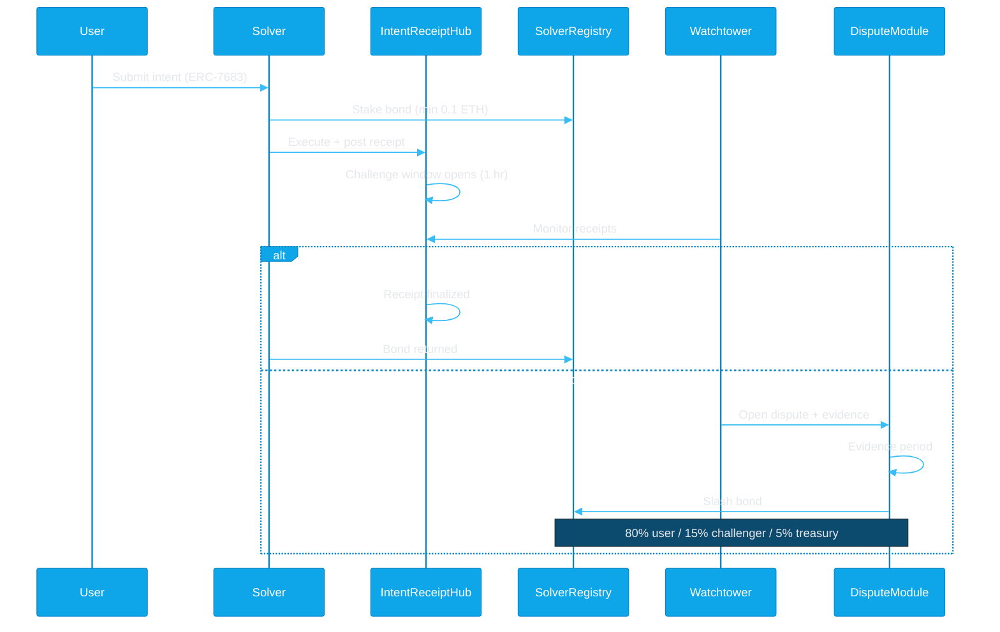
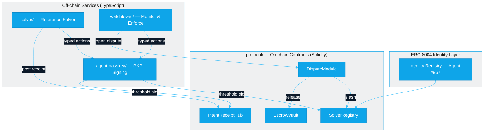

<p align="center">
  <picture>
    <source media="(prefers-color-scheme: dark)" srcset="assets/irsb-banner-dark.svg">
    
  </picture>
</p>

<p align="center">
  <a href="https://github.com/intent-solutions-io/irsb/blob/main/LICENSE"></a>
  
  
  
  
</p>

---

> **Intent protocols like UniswapX, CoW Protocol, and 1inch Fusion route user orders through off-chain solvers — but today there are zero consequences for front-running, delayed fills, or partial execution.** IRSB adds cryptographic receipts, staked bonds, and on-chain dispute resolution so every solver action is accountable.

## How It Works



## Architecture



## Repositories

| Repo | Description | Status |
|------|-------------|--------|
| [protocol](https://github.com/intent-solutions-io/irsb-protocol) | Solidity contracts — receipts, bonds, disputes, escrow (Foundry) | Deployed (Sepolia) |
| [solver](https://github.com/intent-solutions-io/irsb-solver) | Reference solver implementation (TypeScript, Express) | Development |
| [watchtower](https://github.com/intent-solutions-io/irsb-watchtower) | Monitor receipts, detect violations, file disputes (TypeScript, Fastify) | Development |
| [agent-passkey](https://github.com/intent-solutions-io/irsb-agent-passkey) | Policy-gated signing via Lit Protocol PKP (TypeScript, Fastify) | Live (Cloud Run) |

## Live Deployments

| Service | Address / URL | Network |
|---------|---------------|---------|
| SolverRegistry | [`0xB6ab964832808E49635fF82D1996D6a888ecB745`](https://sepolia.etherscan.io/address/0xB6ab964832808E49635fF82D1996D6a888ecB745) | Sepolia |
| IntentReceiptHub | [`0xD66A1e880AA3939CA066a9EA1dD37ad3d01D977c`](https://sepolia.etherscan.io/address/0xD66A1e880AA3939CA066a9EA1dD37ad3d01D977c) | Sepolia |
| DisputeModule | [`0x144DfEcB57B08471e2A75E78fc0d2A74A89DB79D`](https://sepolia.etherscan.io/address/0x144DfEcB57B08471e2A75E78fc0d2A74A89DB79D) | Sepolia |
| Agent Passkey | [Cloud Run](https://irsb-agent-passkey-308207955734.us-central1.run.app) | GCP |
| ERC-8004 Agent | ID `967` on [IdentityRegistry](https://sepolia.etherscan.io/address/0x8004A818BFB912233c491871b3d84c89A494BD9e) | Sepolia |

## Standards

| Standard | Role in IRSB |
|----------|-------------|
| [ERC-7683](https://eips.ethereum.org/EIPS/eip-7683) | Cross-chain intent format — IRSB receipts reference ERC-7683 intent hashes |
| [ERC-8004](https://eips.ethereum.org/EIPS/eip-8004) | Trustless agent identity — IRSB publishes reputation signals to the on-chain registry |
| [x402](https://www.x402.org/) | HTTP payment protocol — IRSB solver can serve as an x402-compatible payment facilitator |

<details>
<summary><strong>Protocol Parameters</strong></summary>

| Parameter | Value |
|-----------|-------|
| Minimum Bond | 0.1 ETH |
| Challenge Window | 1 hour |
| Withdrawal Cooldown | 7 days |
| Max Jails (permanent ban) | 3 strikes |
| Counter-Bond Window | 24 hours |
| Arbitration Timeout | 7 days |

</details>

<details>
<summary><strong>Getting Started</strong></summary>

```bash
# Clone the workspace (docs + cross-cutting research)
git clone https://github.com/intent-solutions-io/irsb.git && cd irsb

# Clone individual repos into the workspace
git clone https://github.com/intent-solutions-io/irsb-protocol.git protocol
git clone https://github.com/intent-solutions-io/irsb-solver.git solver
git clone https://github.com/intent-solutions-io/irsb-watchtower.git watchtower
git clone https://github.com/intent-solutions-io/irsb-agent-passkey.git agent-passkey

# Build & test the protocol
cd protocol && forge build && forge test

# Build & test a TypeScript service
cd ../solver && pnpm install && pnpm build && pnpm test
```

Each repo has its own README and CLAUDE.md with detailed setup and contribution instructions.

</details>

## Documentation

- [AI-CONTEXT.md](./AI-CONTEXT.md) — Full ecosystem reference (contracts, concepts, glossary)
- [000-docs/](./000-docs/) — Architecture decisions and planning documents

## License

MIT
